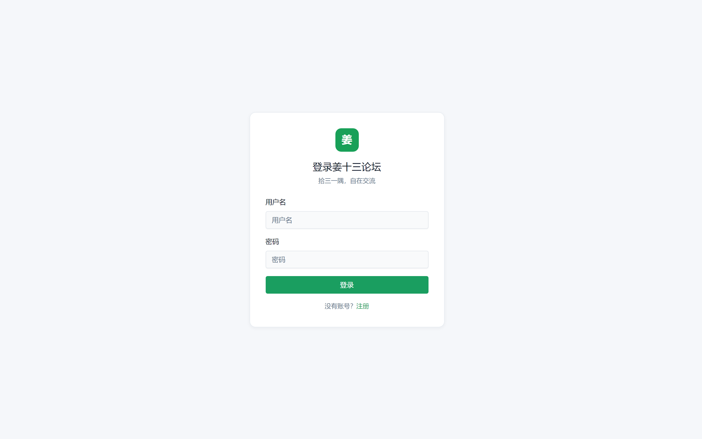

<div align="center">

# 姜十三论坛 Jiang13 Forum

**轻量 · 好看 · 单文件部署的现代化论坛**

面向小圈子内部交流，编译为单个 Go 二进制，前端 SPA 内嵌，内置 SQLite，开箱即用。

<br>

[](LICENSE)
[](go.mod)
[](frontend/package.json)
[](#)

[快速开始](#-快速开始) ·
[界面预览](#-界面预览) ·
[功能亮点](#-功能亮点) ·
[路线图](ROADMAP.md) ·
[参与贡献](CONTRIBUTING.md)

<br>


<sub>浅色主题 · V2EX/NGA 风格三栏布局 · 虚拟滚动帖列表</sub>

<br>

> **开发状态：** 项目积极开发中。管理后台已统一为 React SPA（`/admin`），欢迎参与共建。  
> 查看 [路线图 ROADMAP.md](ROADMAP.md) · [Issues 反馈](https://git.iioio.com/freefire/jiang13-forum/issues)

</div>

---

## 界面预览

> 论坛用户第一眼看到的是界面。姜十三论坛采用清新绿色主题、高密度信息布局，兼顾桌面与移动端体验。

<table>
  <tr>
    <td width="50%" align="center">
      
      <br><b>浅色主题</b><br>
      <sub>左栏板块导航 · 中间帖列表 · 右栏热门/动态/在线</sub>
    </td>
    <td width="50%" align="center">
      
      <br><b>暗色主题</b><br>
      <sub>一键切换 · 护眼阅读 · 全局色彩自适应</sub>
    </td>
  </tr>
  <tr>
    <td width="50%" align="center">
      
      <br><b>帖子详情</b><br>
      <sub>楼层式回复 · 引用回复 · 登录可见内容</sub>
    </td>
    <td width="50%" align="center">
      
      <br><b>移动端适配</b><br>
      <sub>侧栏自动收起 · 触控友好 · 板块快捷筛选</sub>
    </td>
  </tr>
</table>

<p align="center">
  
  <br><b>登录 / 注册</b> — 居中卡片式表单，简洁无干扰
</p>

---

## 功能亮点

### 界面与交互

| 特性 | 说明 |
|------|------|
| **三栏布局** | 左栏板块菜单（可折叠）+ 中间虚拟滚动帖列表 + 右栏热门/通知/在线 |
| **虚拟滚动** | `@tanstack/react-virtual` 驱动帖列表与楼层回复，长列表依然流畅 |
| **已读 / 未读** | 未读高亮、角标提醒、批量标记已读 |
| **主题切换** | 浅色 / 暗色一键切换，跟随 `prefers-color-scheme` 与本地记忆 |
| **响应式** | 平板 / 手机自动收起侧栏，搜索、发帖、登录触手可及 |
| **高密度排版** | V2EX / NGA 风格信息密度，一屏浏览更多内容 |

### 社区功能

- 用户注册 / 登录（bcrypt + JWT Cookie）
- 普通用户 / 管理员两级权限，**首个注册用户自动成为管理员**
- 板块管理、发帖、Markdown / 富文本、标签、置顶
- 楼层式评论，支持回复指定楼层、@ 高亮、引用回复
- 点赞、收藏、热门帖、最新动态
- 管理员后台：删帖、删评论、禁言、SQLite 一键备份
- 内置敏感词过滤、发帖 / 评论限流

### 部署体验

- **单二进制部署** — 与 Gitea 同款 `go:embed` 打包，无需 Nginx 反代静态资源
- **零依赖数据库** — SQLite 内建，数据目录 `--data` 一处管理
- **跨平台** — Windows / Linux / macOS 一键编译

---

## 快速开始

### 1. 编译

**Windows（推荐）：**

```powershell
.\build.ps1
# 或双击 build.bat
```

**Linux / macOS：**

```bash
make build
```

**手动分步（全平台）：**

```bash
cd frontend && npm install && npm run build
cd .. && go build -trimpath -ldflags "-s -w" -o dist/jiang13 ./cmd/jiang13
```

> Windows 自带的 `make` 通常是 Embarcadero MAKE，不能识别本项目 Makefile。请用 `.\build.ps1` 或安装 GNU Make 后再用 `make build`。

跨平台编译：

```powershell
.\build.ps1 -Target build-windows
.\build.ps1 -Target build-linux
.\build.ps1 -Target build-all
```

### 2. 启动

```bash
# Windows
.\dist\jiang13.exe --port 3000 --data ./data

# Linux / macOS
./dist/jiang13 --port 3000 --data ./data
```

### 3. 首次使用

1. 浏览器打开 `http://localhost:3000/register` 注册账号
2. **第一个注册的用户自动成为管理员**
3. 登录后访问 `http://localhost:3000/admin/dashboard` 进入后台

### 启动参数

| 参数 | 默认值 | 说明 |
|------|--------|------|
| `--port` | `3000` | HTTP 监听端口 |
| `--data` | `./data` | 数据目录（SQLite、上传、日志） |
| `--jwt-secret` | 自动生成 | JWT 签名密钥（留空则持久化到 `data/.jwt_secret`） |

---

## 技术栈

| 层级 | 技术 |
|------|------|
| **后端** | Go 1.26 · Gin · GORM · SQLite |
| **前端** | React 18 · Radix UI · Tailwind CSS · TanStack Virtual |
| **构建** | Vite → `go:embed` 内嵌 SPA，单二进制发布 |
| **认证** | bcrypt · JWT Cookie |

---

## 前端开发

日常改前端**不需要**重新 `npm run build` 或 `go build`，Vite 开发服务器支持秒级热更新（HMR，热模块替换）：

```powershell
.\build.ps1 -Target dev    # Windows
make dev                   # Linux / macOS
```

浏览器访问 `http://localhost:5173`，API 自动代理到 `http://localhost:3000`。

**何时需要完整构建：**

- 修改 Go 代码、HTML 模板、embed 静态资源 → `go build` / `make build`
- 发布单二进制前 → `npm run build` + `make build`

> 直接访问 `:3000` 看到的是上次 build 嵌入的前端；开发时请用 `:5173`。

---

## 项目结构

```
jiang13-forum/
├── cmd/jiang13/           # 程序入口
├── config/                # 命令行参数与配置
├── model/                 # GORM 模型与数据库迁移
├── service/               # 业务逻辑（认证、帖子、评论…）
├── handler/               # HTTP 处理器（前台 + 后台）
├── middleware/            # JWT 鉴权、在线状态
├── router/                # 路由注册
├── embed_static/          # go:embed 内嵌的 SPA 与模板
├── frontend/              # React 源码（Vite 构建）
├── docs/screenshots/      # README 界面截图
├── docs/issue-templates.md # Issue 预填模板
├── ROADMAP.md             # 路线图与已知问题
└── scripts/               # 开发辅助脚本
```

---

## 数据目录

```
data/
├── jiang13.db              # SQLite 主数据库
├── jiang13.log             # 运行日志
├── filter_words.txt        # 敏感词配置
├── .jwt_secret             # JWT 密钥（自动生成）
├── uploads/avatars/        # 用户头像
└── jiang13_backup_*.db     # 后台导出的备份
```

---

## 开发状态

项目**积极开发中**，作为论坛产品功能尚未完善，欢迎参与共建。

| 类型 | 示例 |
|------|------|
| ✅ 已可用 | 三栏布局、暗色主题、虚拟滚动、楼层评论 |
| ✅ 管理后台 | React SPA：`/admin/dashboard` 仪表盘、帖子置顶、用户禁言等 |
| 📋 计划中 | 通知已读优化、邮件提醒 |

完整列表见 **[路线图 ROADMAP.md](ROADMAP.md)**。发现问题请提交 [Issues](https://git.iioio.com/freefire/jiang13-forum/issues)，认领任务请参考 [CONTRIBUTING.md](CONTRIBUTING.md)。

---

## 参与贡献

欢迎提交 Issue 和 Pull Request！详见 [CONTRIBUTING.md](CONTRIBUTING.md)。

---

## 许可证

[MIT](LICENSE) — 自由使用、修改与分发。
