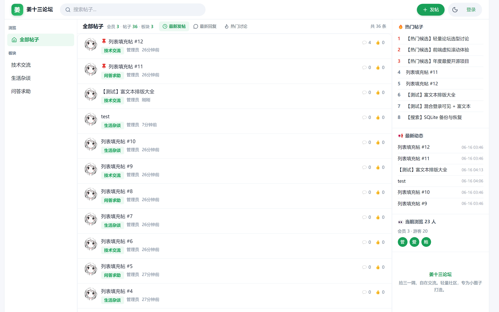
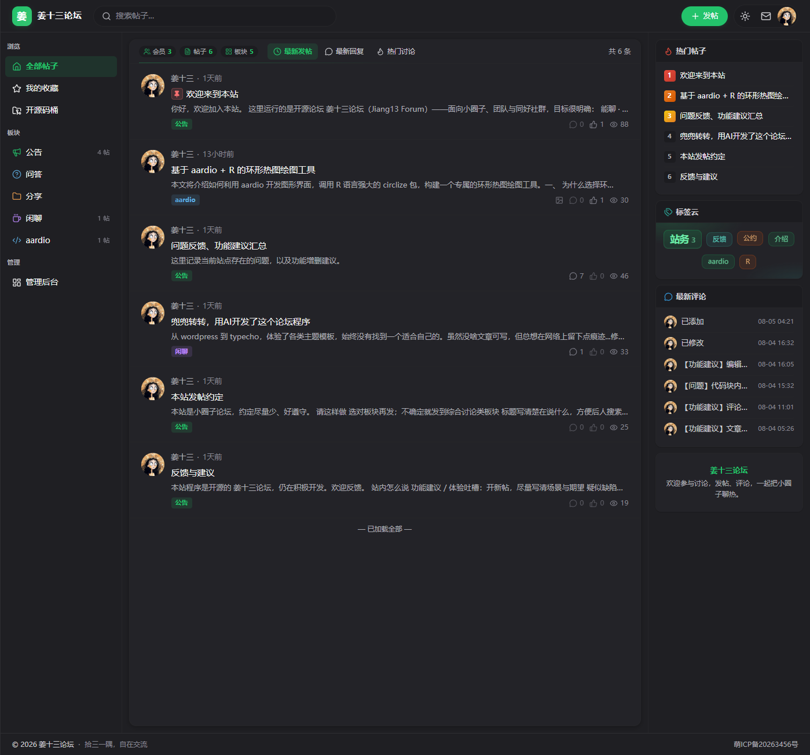
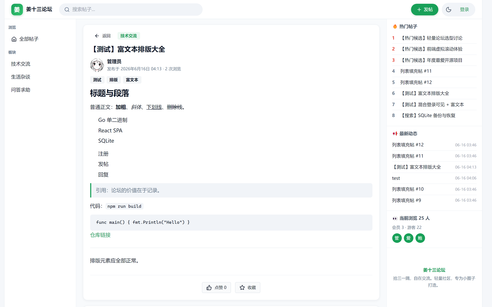
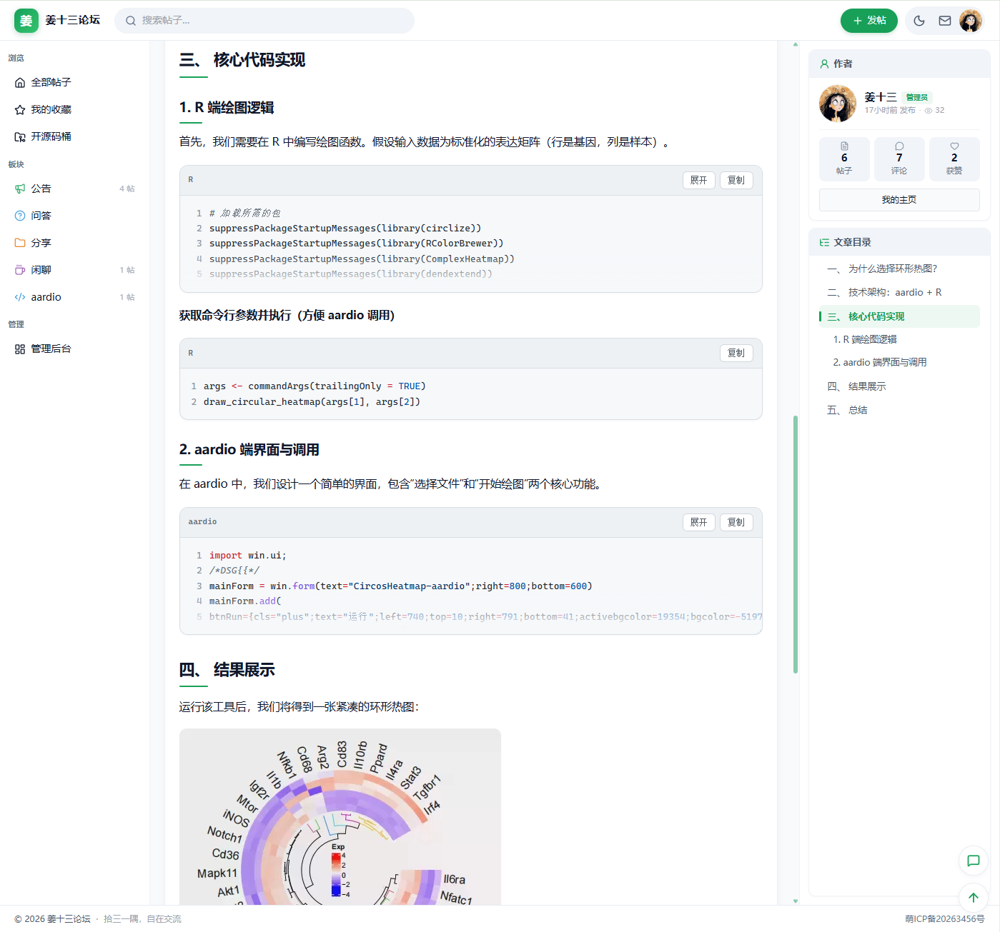
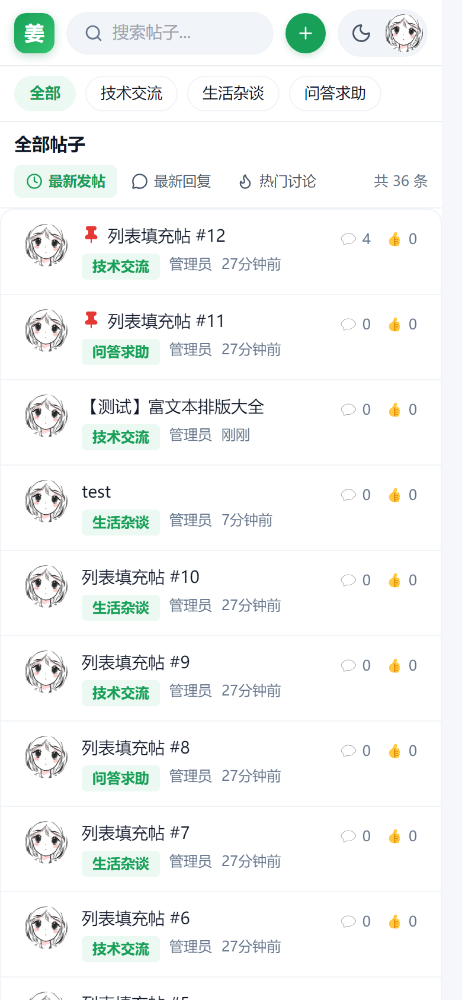

<div align="center">

# 姜十三论坛 Jiang13 Forum

**能聊 · 好看 · 好装**

面向小圈子、团队与同好社群的轻量现代化论坛。  
本分支（`rebuild/gitea-ssr`）：Go 模板真 SSR + `web_src` 渐进增强，单二进制 + SQLite。  
对照 React SPA 请见 `main` 分支。

<br>

[](https://bbs.iioio.com/)
[](LICENSE)
[](https://hub.docker.com/r/hangzhang714128/jiang13-forum)
[](go.mod)
[](docs/rebuild-spec/08-gitea-ssr-architecture.md)
[](#)

[在线演示](https://bbs.iioio.com/) ·
[快速开始](#-快速开始) ·
[界面预览](#-界面预览) ·
[功能亮点](#-功能亮点) ·
[路线图](ROADMAP.md) ·
[参与贡献](CONTRIBUTING.md)

<br>



<sub>浅色主题 · 三栏布局 · Feed 排序 · 板块导航 · 标签云</sub>

<br>

> **演示站点：** [https://bbs.iioio.com/](https://bbs.iioio.com/)（现网多为 `main` SPA）  
> 本分支按 [Gitea 式 SSR 规格](docs/rebuild-spec/08-gitea-ssr-architecture.md) 重构；欢迎提 Issue / PR 共建。

</div>

---

## 它是什么

姜十三论坛不做大而全的社区平台，只做好一件事：给「几人到几百人」的内部交流，一个干净、顺手、数据在自己手里的地方。

| 场景 | 说明 |
|------|------|
| 团队 / 工作室 | 需求讨论、进度同步、知识沉淀 |
| 兴趣小圈子 | 同好交流、作品分享、活动组织 |
| 项目配套社区 | 可与 Gitea 等通过 OIDC（开放身份连接）做 SSO（单点登录） |
| 个人站长 | 单机可跑，无需云数据库与一堆微服务 |

---

## 界面预览

截图来自演示站 [bbs.iioio.com](https://bbs.iioio.com/)。

<table>
  <tr>
    <td width="50%" align="center">
      
      <br><b>浅色主题</b><br>
      <sub>左栏板块 · Feed 排序 · 右栏热门 / 标签 / 评论</sub>
    </td>
    <td width="50%" align="center">
      
      <br><b>暗色主题</b><br>
      <sub>一键切换 · 护眼阅读 · 全局色彩自适应</sub>
    </td>
  </tr>
  <tr>
    <td width="50%" align="center">
      
      <br><b>帖子详情</b><br>
      <sub>文章目录 · 标签 · 作者卡片 · 修订信息</sub>
    </td>
    <td width="50%" align="center">
      
      <br><b>富文本渲染</b><br>
      <sub>TipTap 排版 · 图片 · 代码高亮 · 目录导航</sub>
    </td>
  </tr>
</table>

<p align="center">
  
  <br><b>移动端</b> — 板块快捷筛选 · Feed 排序 · 触控友好列表
</p>

---

## 功能亮点

### 界面与交互

| 特性 | 说明 |
|------|------|
| **三栏布局** | 左栏板块导航 + 中间虚拟滚动帖列表 + 右栏热门 / 标签 / 最新评论 |
| **虚拟滚动** | `@tanstack/react-virtual` 驱动长列表，浏览依然流畅 |
| **帖子排序** | 最新发帖 / 最新回复 / 热门讨论 |
| **主题切换** | 浅色 / 暗色，跟随系统偏好并本地记忆 |
| **响应式** | 平板 / 手机自动收起侧栏，搜索、发帖、登录触手可及 |

### 社区功能

- 用户注册 / 登录（bcrypt + JWT Cookie）；**首个注册用户自动成为管理员**
- 板块、发帖、TipTap 富文本、正文图片上传、标签、置顶 / 精华
- 帖子修订历史与 diff（差异）对比；可配置普通用户编辑时限
- 楼层式评论：回复指定楼层、@ 高亮、引用回复；支持回复可见等内容门控
- 点赞、收藏、热门帖、最新评论、站内私信、公开用户主页
- 管理后台：仪表盘、删帖 / 删评、禁言、举报、敏感词、限流、SQLite 一键备份
- 可选：邮件验证码、OIDC Provider、Gitea 仓库同步（开源码桶）、S3 兼容对象存储

### 部署体验

- **单二进制** — `go:embed` 打包前端，无需再单独部署静态资源
- **零依赖数据库** — SQLite 内建，数据目录由 `app.ini` 统一管理
- **跨平台** — Windows / Linux / macOS 一键编译
- **系统服务** — 内置 Linux systemd / Windows Service 注册
- **Docker 单容器** — 多阶段镜像，挂载 `data/` 即可持久化

---

## 快速开始

### 1. 编译

**Windows（推荐）：**

```bat
build.bat
```

> 请通过 `build.bat` 调用（内部已处理 ExecutionPolicy）。不要直接 `.\build.ps1`，也不要在 Windows 上使用系统自带的 Embarcadero `make`。

**Linux / macOS：**

```bash
make build
```

**手动分步（全平台）：**

```bash
cd web_src && npm run build
cd .. && go build -trimpath -ldflags "-s -w" -o dist/jiang13 ./cmd/jiang13
```

跨平台编译：

```bat
build.bat -Target build-windows
build.bat -Target build-linux
build.bat -Target build-all
```

### 2. Docker 部署（推荐）

**一键启动（本地构建）：**

```bash
docker compose up -d --build
```

```bat
.\build.bat -Target compose-up
```

```bash
make compose-up
```

浏览器打开 `http://localhost:3000/register` 注册；**首个用户自动成为管理员**。

**拉取已构建镜像（Docker Hub）：**

```bash
docker pull hangzhang714128/jiang13-forum:latest
docker run -d --name jiang13 \
  -p 3000:3000 \
  -v jiang13-data:/data \
  --restart unless-stopped \
  hangzhang714128/jiang13-forum:latest
```

**数据持久化：** 容器内 `/data` 对应 SQLite、上传、日志与 JWT 密钥，与下方「数据目录」结构一致。可用 Docker volume 或绑定宿主机目录。镜像启动时会自动将 `/data` 卷属主修正为 uid `1000`（`jiang13` 用户），适配 1Panel 等面板挂载的目录。

**若使用旧版镜像仍报 permission denied**，可在宿主机执行：`chown -R 1000:1000 /你的数据目录`

**可选环境变量（容器编排）：**

| 变量 | 说明 |
|------|------|
| `JIANG13_HTTP_PORT` | HTTP 端口（默认 `3000`） |
| `JIANG13_DATA` | 数据目录（默认 `/data`） |
| `JIANG13_JWT_SECRET` | JWT 密钥（留空则自动生成并写入 `/data/.jwt_secret`） |
| `JIANG13_CONFIG` | 配置文件路径 |
| `JIANG13_WORK_PATH` | 工作目录 |

**健康检查：** `GET /health` 返回 `{"status":"ok"}`，供 Docker / 负载均衡探活。

**发布镜像到 Docker Hub（手动）：**

```bash
docker login
.\build.bat -Target docker          # Windows
# make docker                       # Linux/macOS
docker push hangzhang714128/jiang13-forum:1.0.0
docker push hangzhang714128/jiang13-forum:latest
```

或直接构建：

```bash
docker build --build-arg VERSION=1.0.0 -t hangzhang714128/jiang13-forum:1.0.0 -t hangzhang714128/jiang13-forum:latest .
docker push hangzhang714128/jiang13-forum:1.0.0
docker push hangzhang714128/jiang13-forum:latest
```

停止服务：`docker compose down` / `.\build.bat -Target compose-down` / `make compose-down`

**构建失败（无法连接 auth.docker.io）？** Dockerfile 已默认经 DaoCloud 拉取基础镜像。若仍超时，可在 Docker Desktop → Settings → Docker Engine 添加：

```json
{
  "registry-mirrors": ["https://docker.m.daocloud.io"]
}
```

保存并重启 Docker 后重试 `.\build.bat -Target docker`。PowerShell 中请用 `.\build.bat`（带 `.\` 前缀）。

**1Panel 部署提示：**

1. 容器镜像填 `hangzhang714128/jiang13-forum:latest`
2. 端口映射 `3000:3000`
3. 挂载数据卷到容器内 `/data`（镜像会自动修正目录权限）
4. 首次访问 `http://服务器IP:3000/register` 注册管理员

### 3. 直接启动（二进制）

把二进制放到目标目录后直接运行（首次会在同目录生成 `app.ini`）：

```bash
# Windows
.\dist\jiang13.exe

# Linux / macOS
./dist/jiang13
```

也可先复制示例配置再改端口 / 数据目录：

```bash
cp app.ini.example /opt/jiang13/app.ini
# 编辑 app.ini 后：
./jiang13
```

### 4. 首次使用

1. 浏览器打开 `http://localhost:3000/register` 注册账号
2. **第一个注册的用户自动成为管理员**
3. 登录后访问 `http://localhost:3000/admin` 进入后台

### 配置文件（`app.ini`）

默认读取**工作目录**下的 `app.ini`（工作目录默认可执行文件所在目录）。

```ini
[server]
HTTP_PORT = 3000

[paths]
DATA = data

[security]
JWT_SECRET =
```

完整示例见 [`app.ini.example`](app.ini.example)。OIDC、邮件、Gitea 同步、对象存储等请在管理后台「系统设置」配置（保存即生效）。

**优先级：** 命令行显式参数 > `app.ini` > 内置默认值。

### 启动参数

| 参数 | 默认值 | 说明 |
|------|--------|------|
| `--work-path` | 可执行文件目录 | 工作目录（`app.ini` 与相对 `DATA` 的基准） |
| `--config` | `{work-path}/app.ini` | 配置文件路径 |
| `--port` | （读配置 / `3000`） | HTTP 监听端口 |
| `--data` | （读配置 / `data`） | 数据目录 |
| `--jwt-secret` | 自动生成 | JWT 签名密钥（留空则持久化到 `data/.jwt_secret`） |
| `--service` | （空） | `install` / `uninstall` / `start` / `stop` / `restart` / `status` |

**环境变量（容器 / 编排，优先级低于命令行）：** `JIANG13_HTTP_PORT`、`JIANG13_DATA`、`JIANG13_JWT_SECRET`、`JIANG13_CONFIG`、`JIANG13_WORK_PATH`

### 5. 注册为系统服务（可选）

将二进制与 `app.ini` 放到同一目录后注册即可。之后改端口或数据目录只需编辑 `app.ini` 并重启服务，不必重新安装。

**Ubuntu / Linux（systemd，需 root）：**

```bash
sudo mkdir -p /opt/jiang13
sudo cp jiang13 /opt/jiang13/
sudo /opt/jiang13/jiang13 --service install
sudo /opt/jiang13/jiang13 --service start
sudo systemctl enable jiang13
```

**Windows（Windows Service，需管理员 PowerShell）：**

```powershell
New-Item -ItemType Directory -Force -Path C:\jiang13 | Out-Null
Copy-Item .\jiang13.exe C:\jiang13\
C:\jiang13\jiang13.exe --service install
C:\jiang13\jiang13.exe --service start
```

> 改 `app.ini` 后执行 `--service restart`。运行日志写入数据目录下的 `jiang13.log`。

---

## 技术栈

| 层级 | 技术 |
|------|------|
| **后端 / SSR** | Go 1.26 · Gin · GORM · SQLite · `html/template` |
| **渐进资源** | `web_src/`（构建到 `public/assets/`，URL `/ssr-assets/`） |
| **构建** | `web_src` → `go:embed` templates + assets，单二进制发布 |
| **认证** | bcrypt · JWT Cookie · 可选 OIDC Provider |
| **对照 SPA** | 仅 `main` 分支（React 18 · TipTap · Vite） |

---

## 本地开发（SSR）

```bat
build.bat -Target run
```

```bash
make run
```

浏览器访问 `http://localhost:3000`。数据目录默认 `dist/data`。

改模板 / Go 后重启进程；改 `web_src` 后需再跑 `build.bat -Target web-src`（或完整 `build`）。

需要对照旧 SPA UI：`git checkout main` 或 `git worktree add ../jiang13-spa main`。

---

## 项目结构

```
jiang13-forum/                 # 分支 rebuild/gitea-ssr
├── cmd/jiang13/               # 程序入口（含系统服务注册）
├── config/                    # app.ini 与命令行配置
├── app.ini.example
├── Dockerfile                 # web_src → Go → Alpine
├── docker-compose.yml
├── models/                    # GORM 模型
├── services/                  # 业务逻辑
├── routers/
│   ├── setup.go               # 路由总装
│   ├── web/                   # HTML SSR
│   └── api/                   # JSON API
├── modules/
│   ├── auth/                  # JWT / 限流
│   ├── webrender/             # 模板渲染
│   └── seo/
├── templates/                 # Go html/template（embed）
├── web_src/                   # 渐进 CSS/JS 源码
├── public/assets/             # web_src 构建产物（embed）
├── docs/rebuild-spec/         # 产品规格与 SSR 架构
├── docs/screenshots/
└── ROADMAP.md
```

> SPA 源码树仅存在于 `main`（`frontend/`、`embed_static/`）。

---

## 数据目录

```
data/
├── jiang13.db              # SQLite 主数据库
├── jiang13.log             # 运行日志
├── filter_words.txt        # 敏感词配置
├── .jwt_secret             # JWT 密钥（自动生成）
├── uploads/avatars/        # 用户头像
├── uploads/posts/          # 帖子正文图片
└── jiang13_backup_*.db     # 后台导出的备份
```

---

## 开发状态

项目**积极开发中**，欢迎参与共建。完整列表见 **[ROADMAP.md](ROADMAP.md)**。

| 类型 | 示例 |
|------|------|
| ✅ 已可用 | 三栏布局、暗色主题、虚拟滚动、Feed 排序、楼层评论 |
| ✅ 发帖体验 | TipTap 富文本、图片上传、修订历史、回复可见等门控 |
| ✅ 管理后台 | JSON API 已就绪；本分支管理 UI 为 SSR 占位（完整后台见 `main` SPA） |
| 📋 计划中 | 通知动态优化、邮件提醒 |

---

## 参与贡献

欢迎提交 Issue 和 Pull Request！详见 [CONTRIBUTING.md](CONTRIBUTING.md)。

在线体验与反馈也可直接在演示站进行：[https://bbs.iioio.com/](https://bbs.iioio.com/)

---

## 许可证

[MIT](LICENSE)（与 [Gitea](https://github.com/go-gitea/gitea) 相同的 Expat 文本格式）— 自由使用、修改与分发。
