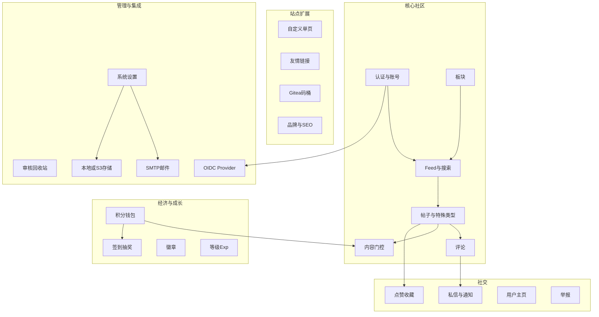

# 01 · 产品定位与模块地图

> **读者**：重构架构师 / 产品对齐  
> **前置**：[README.md](README.md)  
> **后续**：[02-features.md](02-features.md)  
> **源码**：[docs/introduction.md](../introduction.md)、[README.md](../../README.md)

---

## 1. 定位

姜十三论坛不做大而全公网社区，只服务「几人到几百人」的内部交流：

| 场景 | 说明 |
|------|------|
| 团队 / 工作室 | 需求讨论、进度同步、知识沉淀 |
| 兴趣小圈子 | 同好交流、作品分享、活动组织 |
| 项目配套社区 | 可与 Gitea 通过 OIDC（开放身份连接）做 SSO（单点登录） |
| 个人站长 | 希望数据自管、部署简单 |

**产品口号气质**：能聊 · 好看 · 好装（部署简单）。

**规模预期**：非百万用户级；信息密度接近 V2EX / NGA 一类，而非大留白营销站。

---

## 2. 产品 vs 运维（拆开看待）

| 维度 | 当前实现 | 重构时 |
|------|----------|--------|
| **产品** | 论坛功能全集（见模块地图） | **必须对齐**功能与规则 |
| **运维** | 单二进制 + 内嵌 SPA + SQLite + `app.ini` | **可选保留**；可换容器 / PG / 分离部署 |

规格文档把「用户能做什么」写死；把「怎么打包发布」放在 [07-config-ops.md](07-config-ops.md) 供参考。

---

## 3. 角色模型

| 角色 | 识别 | 能力摘要 |
|------|------|----------|
| **游客** | 未登录 | 浏览公开内容；可发表游客评论（需昵称等）；门控内容按规则遮盖 |
| **登录用户** | JWT Cookie 有效且未禁言 | 发帖、评论、点赞收藏、私信、签到抽奖、友链申请、举报等 |
| **认证用户** | `user.verified = true` | 与管理员一样：**发帖/评论免审**（`SkipsModeration`） |
| **管理员** | `role = admin` | 全部后台能力；免审；看待审/被拒内容 |
| **系统** | 私信 `from_user_id = 0` | 发系统通知（审核、回复提醒、举报结果等） |

**引导规则**：站点**第一个注册用户自动成为管理员**（无安装向导单独建管步骤）。

禁言用户（`banned`）：带鉴权的写接口被拒绝；浏览策略以实现为准，前端通常视为不可正常互动。

---

## 4. 模块地图

### 4.1 认证与账号

- 注册 / 登录 / 登出；可选邮箱验证码；忘记密码重置
- 图形验证码（注册场景）
- 个人资料：昵称、签名、头像、改密
- 邮件未配置时可能关闭公开注册（见业务规则）

### 4.2 板块与 Feed

- 多板块；图标与色板；排序
- 首页「全部」+ `/board/:id`
- 排序：最新发帖 / 最新回复 / 热门
- 搜索：关键词、标签、作者、仅标题
- 列表样式：仅标题 / 摘要 / 缩略图（后台可配）

### 4.3 帖子

- 富文本正文（HTML，TipTap 产出）+ 可选 Markdown 编辑面
- 标签、修订历史与 diff
- 五种类型：`normal` | `question` | `poll` | `bounty` | `lottery`
- 运营标记：全局置顶、版内置顶、精华、禁止编辑、禁止评论
- 审核状态：`pending` | `published` | `rejected`；软删回收站

### 4.4 内容门控

正文内嵌自定义标签（非独立表行，存在 `posts.content` HTML 中）：

| 标签 | 含义 |
|------|------|
| `<members-only>` | 登录可见 |
| `<reply-only>` | 本帖已回复可见 |
| `<points-only data-cost="N">` | 积分解锁；按块计费 |

### 4.5 评论

- 楼层号；回复指定楼；嵌套展示；引用；@ 提及
- 游客评论字段；私密评论（仅相关人可见）
- 点赞、编辑时限、审核、软删

### 4.6 积分经济与成长

- **Points**：可消费积分（签到、抽奖、解锁、悬赏托管等）
- **Exp**：不可消费经验 → 等级 Lv1–10
- **CreatorIncomeTotal**：创作分成累计（徽章指标）
- 徽章：自动（门槛）+ 限定（管理员发放）

### 4.7 私信与通知

统一走 `private_messages` 表，用 `kind` 区分用户私信与系统事件。

### 4.8 友链与站点页

- 管理员维护品牌友链 JSON；用户申请审核（可选回链检测）
- 自定义单页（关于、版规等）：slug、发布、导航/页脚展示

### 4.9 Gitea 开源码桶

后台配置后定时同步公开仓库到 `gitea_repos`，前台 `/projects` 展示。

### 4.10 OIDC Provider

本站作为 IdP：Discovery / Authorize / Token / UserInfo / Logout / JWKS；多 OAuth 客户端。

### 4.11 管理后台

仪表盘、板块、单页、友链、帖/评、举报、用户、徽章、媒体、系统设置、SQLite 备份。

### 4.12 SEO / 发现

`robots.txt`、`sitemap.xml`、Open Graph / Twitter / JSON-LD；当前另有爬虫 HTML。新站应用 SSR 统一，但 **meta 字段集合应保留**（见 [07-config-ops.md](07-config-ops.md)）。

---

## 5. 权限一句话

- **读公开内容**：人人可（含游客）  
- **写内容**：登录（部分评论允许游客）  
- **审与运营**：管理员  
- **免审写**：管理员或 `verified`  

细节状态机见 [05-business-rules.md](05-business-rules.md)。
