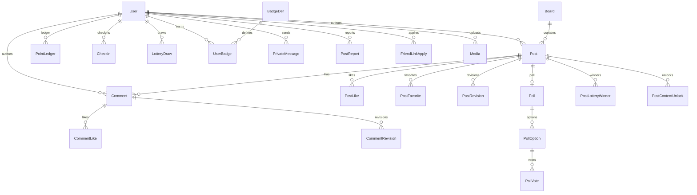

# 03 · 数据模型

> **读者**：实现数据库与领域层的 AI  
> **前置**：[01-product.md](01-product.md)  
> **后续**：[04-api.md](04-api.md)、[05-business-rules.md](05-business-rules.md)  
> **源码**：[`model/models.go`](../../models/models.go)、[`model/oauth.go`](../../models/oauth.go)、[`model/gitea.go`](../../models/gitea.go)、[`model/level.go`](../../models/level.go)、[`model/db.go`](../../models/db.go)、[`model/user_view.go`](../../models/user_view.go)、[`service/settings.go`](../../services/settings.go)

当前无独立 SQL migration；表由 GORM `AutoMigrate` 创建。新站可用正式 migration，但**字段语义应对齐**。

---

## 1. ER 概览



另有：`ForumSetting`（键值）、`Session`（浏览器 opaque 会话）、`OAuthClient` / `OAuthAuthCode`、`GiteaRepo`、`SitePage`。

---

## 2. 表与字段

说明：`json:"-"` 表示默认 API 序列化隐藏；软删列 `deleted_at` 表示 GORM soft delete。

### 2.0 sessions

| 列 | 类型 | 说明 |
|----|------|------|
| id | string(64) PK | 密码学随机 opaque id（Cookie `jiang13_session` 的值） |
| user_id | uint index | 用户 |
| expires_at | time index | 过期；默认 TTL 7 天，滑动续期 |
| created_at / last_seen_at | time | |
| ip / user_agent | string | 可选审计 |

登出删单行；禁言 / 改密删该用户全部 session。每次请求以 DB 中 `users.role` / 禁言为准。

### 2.1 users

| 字段 | 类型 | 约束 | 说明 |
|------|------|------|------|
| id | uint PK | | |
| username | string(128) | unique, not null | 登录名 |
| email | string(128) | index, default '' | 公开主页不返回 |
| password | string(128) | not null | bcrypt 哈希，永不返回 |
| nickname | string(64) | | 展示名 |
| signature | string(512) | default '' | 个人签名 |
| avatar | string(512) | | 相对或绝对 URL |
| role | string(16) | default `user` | `user` \| `admin` |
| verified | bool | index | 站长认证，免审 |
| exp | int | default 0 | 经验（不可消费） |
| points | int | default 0 | 可用积分 |
| creator_income_total | int | default 0 | 创作分成累计 |
| banned | bool | | 禁言 |
| banned_at | *time | | |
| last_login_at | *time | json 隐藏 | |
| last_login_ip | string(45) | json 隐藏 | |
| last_access_at | *time | json 隐藏 | 带鉴权访问 |
| created_at / updated_at | time | | |
| deleted_at | soft | | |

**非落库展示字段**：`level`（由 Exp 推导）、`badges`（附加）。

视图结构：`UserPublic` / `UserSelf` / `UserAdmin`（见 [`model/user_view.go`](../../models/user_view.go)）。

### 2.2 boards

| 字段 | 说明 |
|------|------|
| id, name(64), description(512) | |
| icon(64), color_index(default -1) | -1=按 id 自动取色 |
| sort_order | 升序 |
| created_at, updated_at, deleted_at | |

### 2.3 posts

| 字段 | 说明 |
|------|------|
| id, board_id, user_id | FK 索引 |
| title(256), content(text) | HTML 正文 |
| content_plain(text) | 纯文本搜索索引，`json:"-"` |
| tags(256) | 逗号或空格分隔标签串 |
| post_type | `normal`\|`question`\|`poll`\|`bounty`\|`lottery` |
| question_resolved | 仅问答 |
| bounty_points, bounty_status, bounty_comment_id | 悬赏 |
| lottery_winner_count, lottery_status | 抽奖帖 |
| pinned | 全局置顶 |
| board_pinned | 版内置顶 |
| featured | 精华 |
| edit_locked | 禁止编辑 |
| comments_locked | 禁止新评论 |
| status | `pending`\|`published`\|`rejected` |
| like_count, view_count | |
| timestamps + soft delete | |

关联：Board, User, Comments。

### 2.4 post_revisions

每次修改前保存旧版：`post_id`, `editor_id`, `title`, `content`, `tags`, `created_at`。

### 2.5 comments

| 字段 | 说明 |
|------|------|
| post_id, user_id | user_id=0 表示游客 |
| floor | 楼层号 |
| content | HTML/富文本 |
| reply_to | *uint 回复目标评论 |
| guest_nick / guest_email / guest_url | 游客信息 |
| is_private | 私密评论 |
| status | pending\|published\|rejected |
| like_count | |
| soft delete | |

**非落库**：`reply_target`, `thread_parent_id`, `content_hidden`, `liked`。

### 2.6 comment_revisions

`comment_id`, `editor_id`, `content`, `created_at`（管理员可查）。

### 2.7 post_likes / comment_likes / post_favorites

唯一索引：(post_id|comment_id, user_id)。收藏带 Post 关联。

### 2.8 private_messages

| 字段 | 说明 |
|------|------|
| from_user_id | 0=系统 |
| to_user_id | |
| subject(256), content(text) | |
| kind | 见枚举 |
| related_post_id, related_report_id | 可选 |
| is_read | |
| created_at | |

### 2.9 post_reports

帖或评举报：`post_id` 必填；`comment_id` 有值则为评论举报。  
`reason`, `detail`, `status`, `handler_id`, `handle_note`, `handled_at`。

### 2.10 friend_link_applies

申请字段：name, url, description, logo, reciprocal_page_url, link_on_homepage,  
reciprocal_verified / check_note / checked_at, status, review_note, reviewed_at + soft delete。

### 2.11 media

上传索引：`category`=`avatars`\|`posts`\|`site`；`name`, `url`(unique), `size`, `content_type`, `storage_type`=`local`\|`s3`, `user_id`。

### 2.12 point_ledgers

`user_id`, `delta`, `balance`(变动后), `reason`, `ref_type`, `ref_id`, `note`, `created_at`。

### 2.13 check_ins

唯一 `(user_id, day)`，day=`YYYY-MM-DD`；`points`, `streak`。

### 2.14 lottery_draws

每日抽奖唯一 `(user_id, day)`；`points` 可为 0。

### 2.15 post_content_unlocks

唯一 `(user_id, post_id, block_key)`；`cost`。

### 2.16 site_pages

`title`, `slug`(unique), `content`, `published`, `sort_order`, `show_in_footer`, `show_in_nav` + soft delete。

### 2.17 polls / poll_options / poll_votes

- Poll：`post_id` unique；`multi`, `max_choices`, `closed`, `ends_at`
- Option：`post_id`, `text`(64), `sort_order`, `vote_count`
- Vote：唯一 `(post_id, option_id, user_id)`（多选时多行）

### 2.18 post_lottery_winners

`post_id`, `user_id`, `comment_id`, `created_at`。

### 2.19 badge_defs / user_badges

BadgeDef：`code` unique, `name`, `description`, `icon`, `kind`=`auto`\|`limited`, `metric`, `threshold`, `sort_order`, `enabled`。  
UserBadge：唯一 `(user_id, badge_id)`；`awarded_at`, `awarded_by`(0=系统)。

### 2.20 forum_settings

| 字段 | 说明 |
|------|------|
| key | PK string(64) |
| value | string(2048) |

### 2.21 oauth_clients / oauth_auth_codes

Client：`client_id` unique, `client_secret_hash`, `name`, `redirect_uris`(可多行), `enabled`。  
AuthCode：一次性码 + PKCE 字段 + `expires_at` + `used`。

### 2.22 gitea_repos

同步缓存：`gitea_id` unique, owner/name/full_name, description, html_url, language, stars/forks, private, updated_at_remote, forum_user_id, synced_at。

---

## 3. 枚举全集

### 3.1 角色 Role

`user` | `admin`

### 3.2 内容状态 ContentStatus

`pending` | `published` | `rejected`

### 3.3 帖类型 PostType

`normal` | `question` | `poll` | `bounty` | `lottery`

### 3.4 悬赏 BountyStatus

`open` | `awarded` | `refunded`（空串视为非悬赏）

### 3.5 帖内抽奖 PostLotteryStatus

`open` | `drawn`

### 3.6 私信 kind

| 值 | 含义 |
|----|------|
| user | 用户互发 |
| system | 系统通知 |
| reject | 帖/评被拒 |
| report_result | 举报处理结果 |
| reply | 被回复 |
| mention | 被 @ |
| moderation | 待审提醒管理员 |

### 3.7 举报

Status：`pending` | `resolved` | `dismissed`  
Reason：`spam` | `abuse` | `illegal` | `irrelevant` | `other`

### 3.8 友链申请

`pending` | `approved` | `rejected`

### 3.9 积分 reason

| 值 | 含义 |
|----|------|
| check_in | 签到 |
| lottery | 每日抽奖 |
| unlock_spend | 解锁消费 |
| creator_income | 创作分成 |
| admin_adjust | 管理员调账 |
| bounty_escrow | 悬赏托管 |
| bounty_award | 悬赏发放 |
| bounty_refund | 悬赏退回 |

### 3.10 徽章

Kind：`auto` | `limited`  
Metric：`tenure_days` | `likes_received` | `creator_income`

---

## 4. 等级（Exp → Level）

源：[`model/level.go`](../../models/level.go)

| Level | 最低 Exp |
|-------|----------|
| 1 | 0 |
| 2 | 20 |
| 3 | 50 |
| 4 | 100 |
| 5 | 200 |
| 6 | 400 |
| 7 | 800 |
| 8 | 1500 |
| 9 | 3000 |
| 10 | 5000 |

管理员设等级时，应把 Exp 调到该等级门槛（见后台 API）。

---

## 5. 内置自动徽章（seed）

源：[`model/db.go`](../../models/db.go) `seedDefaultBadges`

| code | 名称 | metric | threshold |
|------|------|--------|-----------|
| tenure_30 | 初来乍到 | tenure_days | 30 |
| tenure_365 | 资深居民 | tenure_days | 365 |
| likes_10 | 小有人气 | likes_received | 10 |
| likes_100 | 人气作者 | likes_received | 100 |
| likes_1000 | 人气巨星 | likes_received | 1000 |
| income_100 | 小有进账 | creator_income | 100 |
| income_1000 | 创作达人 | creator_income | 1000 |

已存在同 `code` 则跳过插入。

---

## 6. forum_settings 键与默认值

源：[`service/settings.go`](../../services/settings.go)、[`service/permalink.go`](../../services/permalink.go)

### 6.1 论坛限制

| Key | 默认 | 说明 |
|-----|------|------|
| post_edit_window_hours | 24 | 0 可表示特殊策略，以实现为准 |
| comment_edit_window_minutes | 3 | |
| rate_limit_post | 10 | 窗口内次数 |
| rate_limit_comment | 10 | |
| rate_limit_register | 10 | |
| rate_limit_login | 10 | |
| rate_limit_window_sec | 60 | |
| post_title_max | 128 | |
| post_tags_max | 256 | |
| post_content_max | 50000 | |
| comment_max | 5000 | |
| search_keyword_min | 1 | |
| search_keyword_max | 50 | |
| page_size_default | 30 | API 硬上限 100 |
| password_min_len | 6 | |
| avatar_max_mb | 2 | |
| signature_max | 200 | |
| open_posts_in_new_tab | 1 | |
| open_content_links_in_new_tab | 1 | |

### 6.2 Feed / 侧栏 / 友链展示

| Key | 默认 |
|-----|------|
| feed_list_style | `title`（另有 `excerpt` / `thumbnail`） |
| aside_show_tag_cloud | 0 |
| aside_show_recent_comments | 0 |
| aside_show_friend_links | 1 |
| aside_widgets | JSON 数组，见下 |
| nav_show_friend_links | 1 |
| footer_show_friend_links | 1 |
| friend_link_reciprocal_check | 0 |
| permalink_enabled | 0 |
| permalink_ext | `html` |

默认 `aside_widgets`：

```json
[
  {"id":"tag_cloud","enabled":false},
  {"id":"recent_comments","enabled":false},
  {"id":"friend_links","enabled":true}
]
```

合法 widget id：`tag_cloud` | `recent_comments` | `recent_users` | `friend_links`。

### 6.3 SMTP

| Key | 默认 |
|-----|------|
| smtp_enabled | 0 |
| smtp_host | |
| smtp_port | 465 |
| smtp_username / smtp_password | |
| smtp_from | |
| smtp_from_name | 姜十三论坛 |
| smtp_encryption | `ssl`（另有 `none` / `starttls`） |

### 6.4 OIDC

| Key | 默认 |
|-----|------|
| oidc_enabled | 0 |
| oidc_root_url | |
| oidc_group_claim | groups |
| oidc_admin_group | gitea-admin |
| oidc_user_group | gitea-users |
| oidc_rsa_private_pem | （空）启用 OIDC 时懒生成并写入；未启用不落盘 `.oidc_rsa.pem` |

### 6.4b 敏感词

| Key | 默认 |
|-----|------|
| filter_words | 默认词表文本；启动时从旧 `filter_words.txt` 导入（若键为空） |

### 6.5 Gitea 同步（**后置**，键保留兼容）

| Key | 默认 |
|-----|------|
| gitea_sync_enabled | 0 |
| gitea_base_url | |
| gitea_token | |
| gitea_sync_interval_min | 60 |

本迭代不启同步任务；见 [02-features.md](02-features.md) §K。

### 6.6 存储

| Key | 默认 |
|-----|------|
| storage_type | local |
| storage_endpoint / region / bucket | region 默认 us-east-1 |
| storage_access_key / storage_secret_key | |
| storage_public_base_url / storage_prefix | |
| storage_force_path_style | 1 |
| storage_image_delivery | webp（或 original） |

### 6.7 站点品牌

| Key | 默认 |
|-----|------|
| site_name | 姜十三论坛 |
| site_slogan | 拾三一隅，自在交流 |
| site_description / site_keywords | 空 |
| site_logo_mark | 姜 |
| site_logo / site_favicon / site_og_image | 空 |
| site_icp_beian | 空 |
| site_icp_beian_url | https://beian.miit.gov.cn/ |
| site_friend_links | `[]` JSON，最多 20 条 |

---

## 7. 升级兼容补丁（现网 InitDB）

[`model/db.go`](../../models/db.go) 在 AutoMigrate 后：

- 空 `status` 的帖/评 → `published`
- 空 `post_type` → `normal`
- Exp=0 用户按存量内容粗算经验：`posts*10 + comments*2 + like_sum`

新站若从空库开始可忽略；若迁移旧库需保留等价 backfill。

---

## 8. 内容门控在库中的形态

**无独立表**存放门控块；存在 `posts.content` HTML 中，例如：

```html
<members-only>...</members-only>
<reply-only>...</reply-only>
<points-only data-cost="10">...</points-only>
```

积分解锁 `block_key` = `sha256(innerHTML)[:16]`（hex），见 [`service/unlock.go`](../../services/unlock.go)。
