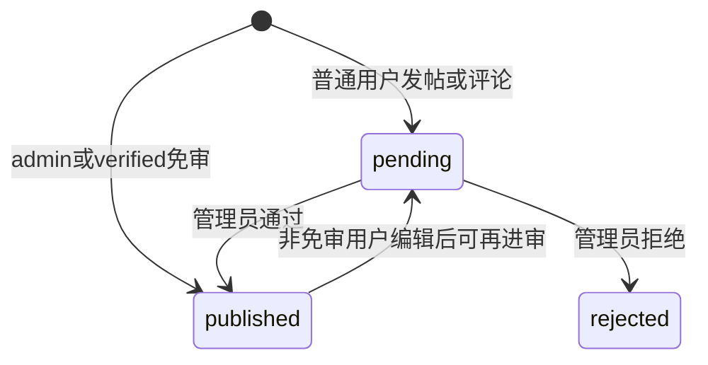
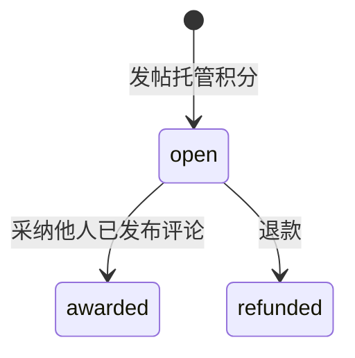

# 05 · 业务规则与状态机

> **读者**：实现领域逻辑的 AI（最易「看起来像但算错」）  
> **前置**：[03-data-model.md](03-data-model.md)、[04-api.md](04-api.md)  
> **源码**：[`service/`](../../services/)、[`model/models.go`](../../models/models.go)

---

## 1. 注册与引导

源：[`handler/handlers.go`](../../routers/api/handlers.go) `APIRegisterConfig`、[`service/auth.go`](../../services/auth.go)

| 规则 | 细节 |
|------|------|
| 首用户 = 管理员 | `UserCount() == 0` 时注册的用户 `role=admin` |
| 开放注册 | `register_open = (userCount == 0) \|\| mailReady` |
| 邮箱验证码 | `require_email_code = mailReady`；邮件未就绪时首用户仍可无码注册 |
| 后续用户 | 邮件未配置则注册关闭，直到管理员配好 SMTP |

密码：bcrypt；最小长度来自 `password_min_len`（默认 6）。

---

## 2. 内容审核

| 规则 | 细节 |
|------|------|
| 免审 | `role=admin` 或 `verified=true`（`SkipsModeration`） |
| 可见性 | `pending`/`rejected`：**仅作者与管理员**可见（对外表现为 404） |
| 列表 | 公开 Feed 只出 `published` |
| 拒绝 | 可写原因；通知作者（站内信 kind=`reject`，可选邮件） |
| 待审提醒 | 通知管理员（kind=`moderation`） |
| 游客评论 | 通常直接或按实现进入审核；勿假设与登录用户完全相同 |

源：[`service/post.go`](../../services/post.go) `CanViewPost`、[`service/comment.go`](../../services/comment.go)。

---

## 3. 编辑时限与锁

| 对象 | 规则 |
|------|------|
| 帖子 | 普通用户在 `post_edit_window_hours`（默认 24）内可编；超时不可（管理员除外） |
| 帖子 | `edit_locked=true` 时非管理员不可编 |
| 评论 | `comment_edit_window_minutes`（默认 3） |
| 评论 | 帖子 `comments_locked` 时禁止新评论 |

详情接口返回 `can_edit`、`edit_block_reason`、`post_edit_window_hours`。

修订：每次成功修改前写入 `post_revisions` / `comment_revisions`（旧内容快照）。

---

## 4. 经验 Exp（不可消费）

| 事件 | Delta |
|------|------|
| 发帖成功（公开路径） | +10 |
| 评论成功 | +2 |
| 帖子被点赞 | +1（作者） |

源：[`service/post.go`](../../services/post.go)、[`service/comment.go`](../../services/comment.go)、[`service/badge.go`](../../services/badge.go) `AddExp`。

等级门槛见 [03-data-model.md](03-data-model.md) §4。管理员设 level 时应同步 Exp 到门槛值。

---

## 5. 内容门控（红action）

源：[`service/content.go`](../../services/content.go)、[`handler/api.go`](../../routers/api/api.go) `APIPostDetail`、[`service/unlock.go`](../../services/unlock.go)

### 5.1 出口顺序（详情）

1. `SanitizePostHTML`（消毒）
2. 若 **游客**：`RedactMembersOnlyHTML` + `RedactReplyOnlyHTML`
3. 若 **已登录** 且非管理员、非作者、且未回复：仅 `RedactReplyOnlyHTML`
4. 作者与管理员：members/reply 块不遮
5. 积分块：按已解锁 key 集合 `RedactPointsOnlyHTML`；作者/管理员策略以实现为准（作者可免费解锁记录）

搜索 / SEO：`RedactGatedPostHTML` = members + reply + points 全遮。

### 5.2 积分解锁

| 项 | 值 |
|----|-----|
| block_key | `hex(sha256(innerHTML))[:16]` |
| cost | `data-cost`，最小 1 |
| 读者 | 扣 `cost`（reason=`unlock_spend`） |
| 作者分成 | `cost * 70 / 100`（`CreatorSharePercent`），reason=`creator_income`；并累加 `creator_income_total` |
| 平台留存 | 剩余 30%（无单独流水，表现为读者扣全额、作者只加 70%） |
| 作者自己 | cost=0 记解锁，无分成 |
| 已解锁 | 返回错误「已解锁」 |
| 防刷 | 双方账号注册未满 **7 天** 且 **LastLoginIP 相同** → 拒绝整单 |

---

## 6. 特殊帖类型

### 6.1 问答 question

- `question_resolved` 布尔；作者（或管理员）可切换
- 列表/详情用图标展示已解决状态

### 6.2 投票 poll

| 规则 | 细节 |
|------|------|
| 选项数 | 2–10；单选项 ≤64 字 |
| 多选 | `multi`；`max_choices` 钳制在 1..选项数 |
| 截止 | `ends_at` 可选；过期或 `closed` 不可再投 |
| 投票 | 每用户每帖；已投不可改（`ErrPollAlreadyVoted`） |
| 结束 | 作者或管理员 `poll/close` |

### 6.3 悬赏 bounty

| 规则 | 细节 |
|------|------|
| 发帖 | 积分 ≥1；立即 `bounty_escrow` 扣作者积分 |
| 采纳 | 不能采纳自己的回复；评论须 published；全额给评论作者 `bounty_award` |
| 退款 | 状态 open；作者在**无他人已发布回复**时可退；**管理员始终可强制退** |
| 退款后 | status=`refunded`，`bounty_points=0`，积分退回作者 |

### 6.4 抽奖帖 lottery

| 规则 | 细节 |
|------|------|
| 中奖人数 | 1–20 |
| 参与者 | 已发布评论且 **非楼主**；按用户去重（保留最早评论） |
| 开奖 | 作者/管理员；人数不足报错；随机抽取；写 `post_lottery_winners`；status=`drawn` |

---

## 7. 签到与每日抽奖

源：[`service/points.go`](../../services/points.go)

### 签到

- 自然日 `YYYY-MM-DD`（服务器本地时区）每用户一次
- 连续：若昨日报到则 streak+1，否则 1
- 奖励：`5 + (streak-1)`，封顶 **15**，保底 5
- 写 `check_ins` + `point_ledgers` reason=`check_in`

### 每日抽奖

- 每天一次；`cost=0`
- 奖池权重：0×40, 2×30, 5×18, 10×10, 20×2
- 中奖积分入账 reason=`lottery`

---

## 8. 评论特殊规则

| 规则 | 细节 |
|------|------|
| 楼层 | 按帖递增 |
| 私密评论 | 仅作者、帖作者、管理员、以及相关可见链可见（见 `canViewPrivate`） |
| 嵌套 | `thread_parent_id` 在父不可见时回挂祖先 |
| @提及 | 解析后发 kind=`mention` |
| 回复提醒 | kind=`reply`；可选 SMTP |
| HasUserReplied | 已发布或审核中的评论算「已回复」（不含被拒），用于 reply-only |

---

## 9. 举报处理

管理员 `handle` action：

| action | 效果 |
|--------|------|
| dismiss | 驳回举报 |
| resolve | 标记已处理（不必然删内容） |
| reject_post | 拒绝/下架帖 |
| reject_comment | 拒绝评论 |

结果通知举报人（kind=`report_result`）。

---

## 10. 友链

| 规则 | 细节 |
|------|------|
| 申请 | 登录用户；可上传 logo |
| 回链检测 | 设置开启时抓取 reciprocal 页检查是否含本站链接 |
| 通过 | 可写入品牌 `site_friend_links`（视实现：首页展示链接） |
| 展示开关 | nav / footer / aside 独立 |

---

## 11. 敏感词与限流

- 敏感词文件：`data/filter_words.txt`；发帖/评/私信等路径过滤
- 限流动作键：post / comment / register / login / report / message / friend_link 等；窗口秒与次数来自 settings

---

## 12. 徽章自动授予

定期或触发时检查 `BadgeDef`（kind=auto）：tenure_days / likes_received / creator_income 达阈值则写入 `user_badges`。限定徽章仅管理员发放。

---

## 13. 置顶排序语义

| 标记 | 首页全部 Feed | 板块 Feed |
|------|---------------|-----------|
| `pinned` | 抬升 | 抬升 |
| `board_pinned` | **不**抬升 | 抬升 |
| `featured` | 标记展示，不一定改变排序 | 同左 |

具体 SQL/排序实现见 [`service/post.go`](../../services/post.go) ListItems。
