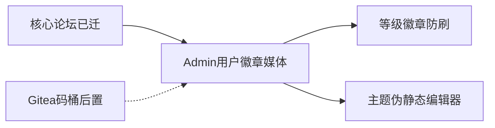

# 09 · SSR 重构进度与路线图

> **读者**：产品方 / 实现 AI  
> **分支**：`rebuild/gitea-ssr`（`main` = SPA 对照）  
> **验收清单**： [02-features.md](02-features.md)  
> **架构**： [08-gitea-ssr-architecture.md](08-gitea-ssr-architecture.md)  
> **维护约定**：每次「继续」开新刀前更新本文「当前指针」；功能勾选以 `02` 为准，本文管阶段与刀序。

---

## 当前指针

| 项 | 值 |
|----|-----|
| **上一刀** | Admin `/admin/users`（禁言 / 认证 / 调积分） |
| **下一刀** | **Admin `/admin/badges`**（徽章定义 CRUD + 授予/撤销） |
| **工作区** | 应干净；有未提交改动时先处理再开新刀 |

---

## 一句话状态

论坛核心闭环（安装、认证、Feed、五种帖类型、评论、私信、友链、审核、回收站、基础设置、备份）**已迁完**。余量主要是 Admin 用户/徽章/媒体、成长体系、OIDC/存储产品化与体验打磨。

---

## 已完成里程碑

### 公开站

| 域 | 状态 |
|----|------|
| `/install`、登录/注册/忘记密码、opaque session | 已迁 |
| Feed / 板块 / 搜索 / 三栏 / 右栏 widgets | 已迁 |
| 帖详情：赞藏举报、门控、审核横幅、修订历史 | 已迁 |
| 帖类型：`normal` / `question` / `poll` / `bounty` / `lottery` | 已迁 |
| 评论：发评/回复/赞/私密/编辑删除/@/回复通知 | 已迁（扁平楼层；嵌套树未做） |
| 私信/系统通知、收藏、个人中心、用户页 | 已迁 |
| 友链前台 + Admin（含复检） | 已迁 |
| 站点单页 | 已迁 |
| `/health`、`robots.txt`、`sitemap.xml`、`/uploads` | 已落地（`02` §O 已勾） |

### Admin

| 路径 | 状态 |
|------|------|
| dashboard / boards / moderation / reports / trash | 已迁 |
| settings：品牌、限流、敏感词、SMTP、侧栏、SQLite 备份 | 已迁 |
| friend-links / pages | 已迁 |
| **users**（禁言 / 认证 / 调积分） | **已迁** |
| **badges / media** | **未迁** |
| settings：OIDC / Gitea / 存储 / 伪静态 Tab | **未迁** |

### 近期提交（摘）

`poll` → SQLite 备份 → 友链复检 → `question` → `bounty` → `lottery` → **Admin users**

---

## 未完成分层

### P0 — 小清理（可夹带）

- 发评路径挂 `RateLimiter` `comment` 动作（服务层已有键，web 未挂）
- Logo/Favicon/OG 上传、头像裁剪等声明为未做的边角

### P1 — 推荐刀序（服务层多半已齐）

1. ~~Admin 用户~~ ✓  
2. **Admin 徽章** ← 当前指针  
3. Admin 媒体列表/删除  

### P2 — 成长与防刷

- Exp → Lv1–10、自动徽章、短龄同 IP 互刷拒绝分成（`02` §H）

### P3 — 体验 / 编辑器（可砍或长期）

- 主题、侧栏折叠、虚拟滚动、`feed_list_style`、伪静态 Admin  
- TipTap / Markdown 双模（现行为 textarea + 门控）  
- 游客评论、评论嵌套树（建议：全局 `#floor` + 缩进）  
- 修订 diff、完整 Limits 字数  

### 后置（不阻塞验收）

- K：Gitea `/projects`  
- L：OIDC 产品化 Admin CRUD  
- M：S3 热切换、WebP thumb 全链路  

---

## 默认「继续」刀序

| 序 | 刀 | 产出 |
|----|----|------|
| ✓ | 五种帖类型 + 备份/复检 + §O 勾选 | 核心闭环 |
| ✓ | 本文 `09` | 可查阅进度 |
| ✓ | Admin `/admin/users` | 禁言/认证/调积分 |
| → | Admin `/admin/badges` | 徽章 CRUD + 授予 |
| 4 | Admin `/admin/media` | 媒体列表删除 |
| 5 | 等级/自动徽章 **或** 防刷分成 | 按当时偏好 |
| … | P3 / 后置 | 需明确点名再开 |

---

## 下一刀实现提纲：Admin 徽章

> 确认「继续」后实现限定徽章定义与授予/撤销；复用 `services/badge.go`。

### 范围（草案）

- `GET/POST /admin/badges`：徽章定义列表与创建/编辑/删除  
- 授予/撤销：挂在用户页或徽章详情（`GrantBadge` / 撤销）  
- 回写 `02` §H 限定徽章；指针 → media  

### 不做

自动徽章规则引擎（P2）、等级设定 UI。

---

## 已完成：Admin 用户管理

见 [plans/admin-users.md](plans/admin-users.md)；路由 `/admin/users` + ban / verify / points。

---

## 如何查阅

| 问题 | 看哪里 |
|------|--------|
| 某功能做没做？ | [02-features.md](02-features.md) 复选框 |
| 现在该干什么？ | 本文「当前指针」 |
| 路由迁没迁？ | [06-pages-ux.md](06-pages-ux.md) §1 |
| 目录约定？ | [08-gitea-ssr-architecture.md](08-gitea-ssr-architecture.md) |
