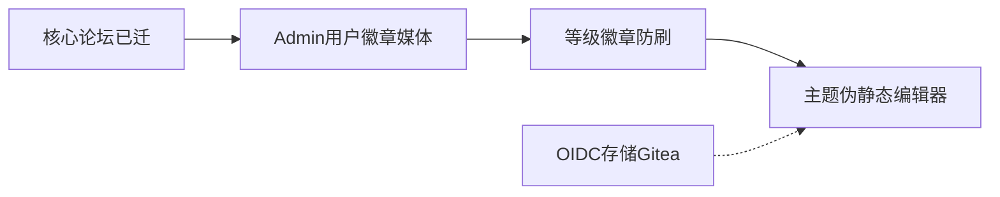

# 09 · SSR 重构进度与路线图

> **读者**：产品方 / 实现 AI  
> **分支**：`rebuild/gitea-ssr`（`main` = SPA 对照）  
> **验收清单**： [02-features.md](02-features.md)  
> **架构**： [08-gitea-ssr-architecture.md](08-gitea-ssr-architecture.md)  
> **维护约定**：每次「继续」开新刀前更新本文「当前指针」；功能勾选以 `02` 为准，本文管阶段与刀序。

---

## 当前指针

| 项 | 值 |
|----|-----|
| **上一刀** | P2：Admin 设等级 + 用户页徽章；勾选 Exp / 防刷 / 自动徽章 |
| **下一刀** | **P3 体验**（主题 / 伪静态 / 编辑器）或 **后置**（OIDC / 存储热切换 / Gitea）；需点名 |
| **工作区** | 应干净；有未提交改动时先处理再开新刀 |

---

## 一句话状态

核心论坛 + Admin P1 + §H 成长/防刷（服务层 + Admin 设等级）**已齐**。余量：P3 体验打磨与后置产品化（OIDC / S3 热切换 / Gitea）。

---

## 已完成里程碑

### 公开站 / Admin / §H

| 域 | 状态 |
|----|------|
| 五种帖类型、评论、私信、友链、单页、§O | 已迁 |
| Admin：users / badges / media / settings 基础 | 已迁 |
| Exp→Lv、Admin 设等级、用户页徽章展示 | 已迁 |
| 短龄同 IP 互刷拒绝分成 | 已落地（unlock 服务） |
| 自动徽章 EvaluateAuto | 已落地（访问用户页触发） |

### 近期提交（摘）

media → **等级设定 + 徽章展示 / §H 勾选**

---

## 未完成分层

### P0 — 小清理（可夹带）

- 发评路径挂 `RateLimiter` `comment` 动作
- Logo/Favicon/OG 上传、头像裁剪

### P2 — 成长与防刷

~~已完成主路径~~；无独立「自动徽章定时任务」Admin UI（可接受）。

### P3 — 体验 / 编辑器 ← 当前候选

- 主题、侧栏折叠、虚拟滚动、`feed_list_style`、伪静态 Admin  
- TipTap / Markdown 双模  
- 游客评论、评论嵌套树  
- 修订 diff、完整 Limits 字数  

### 后置

- K：Gitea `/projects`  
- L：OIDC 产品化 Admin CRUD  
- M：S3 热切换、WebP 全链路产品化  

---

## 默认「继续」刀序

| 序 | 刀 | 产出 |
|----|----|------|
| ✓ | 核心闭环 + Admin P1 | … |
| ✓ | §H 等级/防刷/徽章展示 | … |
| → | 需点名 P3 或后置 | … |

---

## 已完成计划

- [admin-users](plans/admin-users.md) · [admin-badges](plans/admin-badges.md) · [admin-media](plans/admin-media.md)

---

## 如何查阅

| 问题 | 看哪里 |
|------|--------|
| 某功能做没做？ | [02-features.md](02-features.md) 复选框 |
| 现在该干什么？ | 本文「当前指针」 |
| 路由迁没迁？ | [06-pages-ux.md](06-pages-ux.md) §1 |
| 目录约定？ | [08-gitea-ssr-architecture.md](08-gitea-ssr-architecture.md) |
