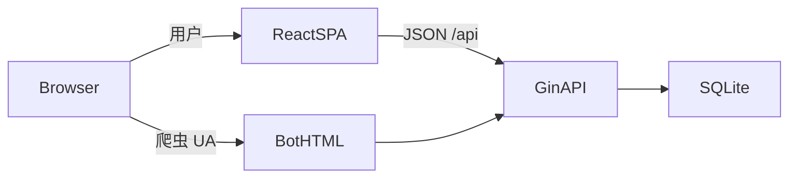

# 姜十三论坛 · 重构规格文档包

> **读者**：准备用新栈（建议真 SSR）重写站点的 AI / 开发者  
> **事实来源**：本仓库现有代码；规格描述「产品必须保留什么」，不是「必须继续用 Go + React SPA」  
> **交叉引用**：[01-product](01-product.md) · [02-features](02-features.md) · [03-data-model](03-data-model.md) · [04-api](04-api.md) · [05-business-rules](05-business-rules.md) · [06-pages-ux](06-pages-ux.md) · [07-config-ops](07-config-ops.md) · [08-gitea-ssr-architecture](08-gitea-ssr-architecture.md) · [09-ssr-progress](09-ssr-progress.md) · [10-design-system](10-design-system.md)

> **实现栈（重构分支）**：Gitea 式 Go 模板 SSR；开发分支 `rebuild/gitea-ssr`；`main` 保留 React SPA 对照。详见 [08](08-gitea-ssr-architecture.md)。

---

## 阅读顺序（请按序投喂）

| 顺序 | 文件 | 用途 |
|------|------|------|
| 1 | 本文 `README.md` | 架构痛点、重构约束、术语 |
| 2 | [01-product.md](01-product.md) | 产品定位、角色、模块地图 |
| 3 | [02-features.md](02-features.md) | 验收级功能清单（可打勾） |
| 4 | [03-data-model.md](03-data-model.md) | 表结构、枚举、设置键、等级徽章 |
| 5 | [04-api.md](04-api.md) | HTTP 合约（路径 / 鉴权 / 请求响应） |
| 6 | [05-business-rules.md](05-business-rules.md) | 状态机与数值规则 |
| 7 | [06-pages-ux.md](06-pages-ux.md) | 路由、布局、编辑器、后台流程 |
| 8 | [07-config-ops.md](07-config-ops.md) | 配置、数据目录、部署、SEO 字段 |
| 9 | [08-gitea-ssr-architecture.md](08-gitea-ssr-architecture.md) | Gitea 式 SSR 分支与目录约定 |
| 10 | [09-ssr-progress.md](09-ssr-progress.md) | **进度与刀序**（「现在做到哪 / 下一刀」） |
| 11 | [10-design-system.md](10-design-system.md) | 公开页视觉 token / 组件（壳层重绘） |

单次 context 不够时：先投喂 `README` + `01` + `02`；跟进度看 `09`；实现某模块时再追加对应 `03`–`06` 章节。

---

## 当前产品是什么

**姜十三论坛（Jiang13 Forum）** 面向小圈子 / 团队 / 同好社群的轻量论坛。

当前实现技术栈（**可抛弃，仅作对照**）：

| 层 | 技术 |
|----|------|
| 后端 | Go · Gin · GORM · SQLite |
| 前端 | React 18 SPA · TipTap · Tailwind · TanStack Virtual |
| 发布 | Vite 构建 → `go:embed` 打进单二进制 |
| 认证 | bcrypt + DB opaque session Cookie（`jiang13_session`） |

演示站：https://bbs.iioio.com/

---

## 为何要重构：架构痛点（必须打破）

| 痛点 | 现状 | 对用户的影响 |
|------|------|----------------|
| 非真 SSR | 生产入口（`main` 的 `embed_static`）只注入 title / branding / Open Graph，**不渲染帖文 DOM** | 刷新先出壳再灌数据，体验不如 SSR |
| 爬虫双轨 | [`routers/api/seo_bot.go`](../../routers/api/seo_bot.go) 对爬虫返回独立 HTML | 用户与爬虫看到的不是同一套渲染路径 |
| 无正式 migration | Schema 靠 GORM `AutoMigrate`（[`models/db.go`](../../models/db.go)） | 升级靠「加字段」，难做破坏性迁移与审计 |
| Cookie JWT（旧） | 浏览器登录曾用 JWT Cookie | **本分支已改为** DB `sessions` + opaque Cookie `jiang13_session`；`.jwt_secret` 仅 CSRF/HMAC |

**新站目标**：用户首屏即可看到帖文 / 列表的服务端渲染（SSR）HTML；SEO meta 与正文同源。技术选型自定（Next.js / Nuxt / Remix / 其它均可）。

---

## 重构时必须保留 vs 可以改

### 必须保留（产品语义）

- [02-features.md](02-features.md) 中列出的功能能力
- [03-data-model.md](03-data-model.md) 中的实体关系与枚举含义（表名可改，语义对齐）
- [05-business-rules.md](05-business-rules.md) 中的数值与状态机（积分、审核、门控、悬赏分成等）
- 角色模型：游客 / 用户 / 认证用户（`verified` 免审）/ 管理员；**管理员仅由 `/install` 创建**（不再首注册变管理员）

### 建议兼容（降低迁移成本）

- [04-api.md](04-api.md) 的 JSON 字段命名与路径形状（可做版本前缀，但旧字段名便于对照）
- Cookie 名 `jiang13_session`（opaque session id；重建分支不做 `jiang13_token` 双读）
- 数据目录语义：`jiang13.db`、`uploads/`；敏感词在 `forum_settings.filter_words`（旧 `filter_words.txt` 可导入）

### 可以彻底改

- 语言与框架（不必再 Go + React SPA）
- 单二进制 / `go:embed`（可改为前后端分离部署）
- SQLite（可换 PostgreSQL 等；规格不强制）
- UI 视觉（布局信息密度见 [06-pages-ux.md](06-pages-ux.md)，视觉可重设）
- 爬虫专用 HTML 双轨（用真 SSR 取代）

---

## 术语表（首次出现）

| 术语 | 中文 | 说明 |
|------|------|------|
| SSR | 服务端渲染 | 首屏 HTML 含正文，非纯客户端壳 |
| SPA | 单页应用 | 当前前台实现形态 |
| OIDC | 开放身份连接 | 本站可作 Provider，供 Gitea 等 SSO |
| JWT | JSON Web Token | OIDC 对外 `id_token`/`access_token` 仍用；**浏览器登录不用 JWT** |
| Opaque session | 不透明会话 | Cookie 只存随机 id，服务端 `sessions` 表可吊销 |
| Feed | 信息流 | 首页 / 板块帖列表 |
| 门控 | Content gate | 登录可见 / 回复可见 / 积分可见区块 |
| 伪静态 | Permalink | 如 `/post/123.html` 的可选后缀 |

---

## 源码速查（核对规格时）

| 主题 | 路径 |
|------|------|
| 路由总装 | [`routers/setup.go`](../../routers/setup.go) |
| GORM 模型 | [`models/models.go`](../../models/models.go) |
| AutoMigrate | [`models/db.go`](../../models/db.go) |
| 论坛设置键 | [`services/settings.go`](../../services/settings.go) |
| SSR 页面路由 | [`routers/web/`](../../routers/web/) |
| JSON API | [`routers/api/`](../../routers/api/) |
| 前端 API / 页面（对照） | 仅 `main`：`frontend/src/api/`、`frontend/src/App.tsx` |
| 产品介绍 | [`docs/introduction.md`](../introduction.md)、[`README.md`](../../README.md) |

---

## 文档包完成标准

另一 AI 仅阅读本目录、**不打开业务源码**，应能：

1. 列出全部用户可见功能与后台能力  
2. 画出核心表 ER 并理解枚举  
3. 实现或 mock 与现网兼容的 API 形状  
4. 复现审核 / 积分 / 门控 / 特殊帖规则  
5. 搭出等价的页面信息架构与关键交互  

若规格与代码冲突：**以代码为准**，并应回写修正本目录文档。
